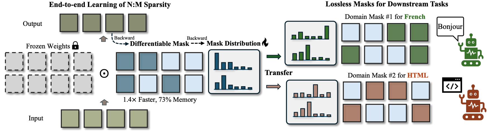
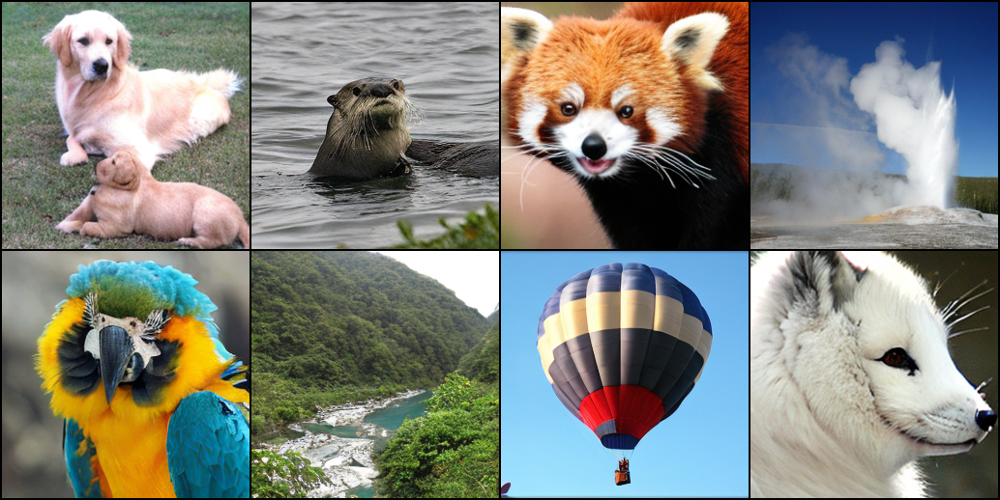
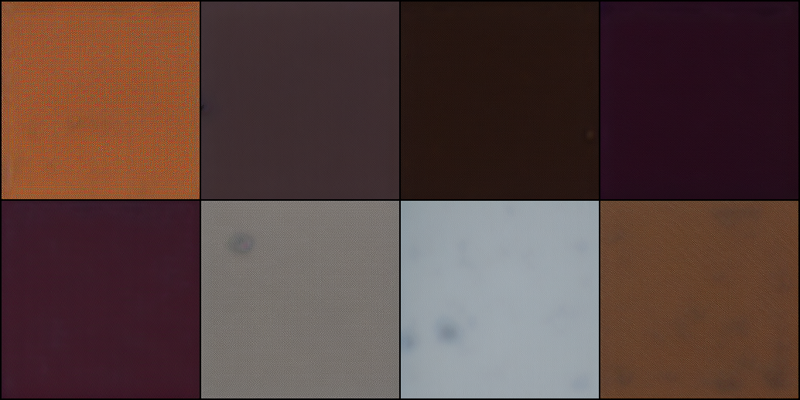
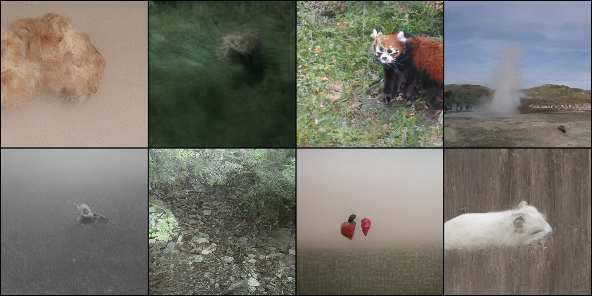
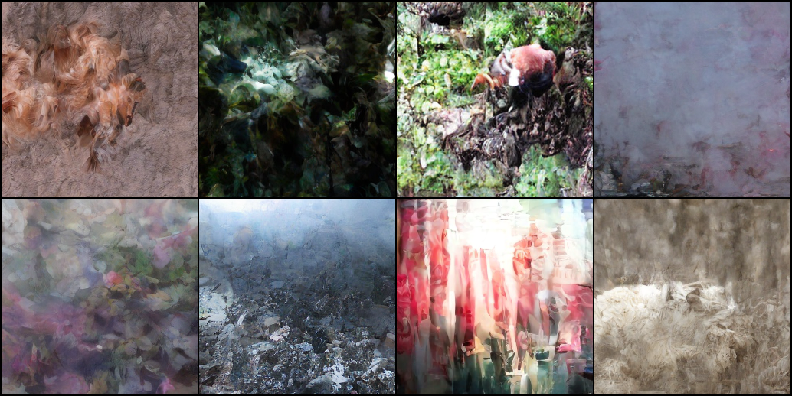

# MaskLLM-4V: MaskLLM for Vision

:paperclip: [[Arxiv]](https://arxiv.org/abs/2409.17481), :rocket: [[NVlabs/MaskLLM (Official)]](https://github.com/NVlabs/MaskLLM)

This repo contains a **minimal re-implementation** of the paper "MaskLLM: Learnable Semi-structured Sparsity for Large Language Models" for **vision tasks**.




## TODO List

- [x] [ViTs on ImageNet-1k (Classification)](#1-maskllm-for-vision-transformers)
- [ ] [DiTs on ImageNet-1k (Generation)](#1-maskllm-for-diffusion-transformers)
- [ ] Multi-modal LLMs
- [ ] Other vision tasks (e.g., object detection, segmentation)
- [ ] TensorRT examples

## Quick Start

To enable MaskLLM on your model, please replace the `nn.Linear` with [`sparsity.maskllm.MaskedLinear`](sparsity/maskllm.py). This can be easily achieved with the following code snippet:
```python
import sparsity
model = sparsity.utils.replace_linear_with_(model, sparsity.maskllm.MaskedLinear, exclude=[model.head], N=2, M=4, hard=False)
print(model)
```

## 🛰️ 1. Results on ViTs

### [ViT-B/16 (augreg_in1k, 224x224)](https://huggingface.co/timm/vit_base_patch16_224.augreg_in1k)

|Method|Sparsity Pattern|Weight Update| Mask Prior | Top-1 Acc. (%) |
|---|:---:|:---:|:---:| :---: |
| ViT-B/16 (in1k) | Dense | - | - | 79.15 |
||
|Magnitude| 2:4 | - | - | 65.92 |
|Wanda| 2:4 | - | - | 63.28 |
|SparseGPT| 2:4 | :heavy_check_mark: | - | 71.52 |
|SparseGPT w/o Update| 2:4 | - | - | 59.72 |
| |
| **MaskLLM-4V (1 Epoch)** | **2:4** | - | SparseGPT | **76.23** |
| **MaskLLM-4V (1 Epoch)** | **2:4** | - | Magnitude | **76.18** |
| **MaskLLM-4V (20 Epochs)** | **2:4** | - | SparseGPT | **79.46** |
| **MaskLLM-4V (20 Epochs)** | **2:4** | - | Magnitude | **79.28** |


*Note: MaskLLM learns a separate mask with frozen network parameters for sparsification. For ViT-B/16, we can find a lossless mask through end-to-end training*


### 1.0. Dataset Preparation
Please prepare the ImageNet-1k dataset under `./data/imagenet` directory. The directory structure should be as follows:
```bash
data
├── imagenet
│   ├── train
│   │   ├── n01440764
│   │   ├── n01443537
│   │   ├── n01484850
│   │   ├── n01491361
│   └── val
│   │   ├── n01440764
│   │   ├── n01443537
│   │   ├── n01484850
│   │   ├── n01491361
```


### 1.1. MaskLLM for [Vision Transformers](https://arxiv.org/abs/2010.11929)

We trained MaskLLM on ViT-B/16 with 4x24GB GPUs, requiring 17G memory on each GPU with a batch size of 128. 

#### Generate Mask Prior

We first generate prior masks using oneshot pruning. This prior mask will hugely accelerate the convergence speed of the MaskLLM. replace the ``--pruner`` argument with ``magnitude``, ``wanda``, or ``sparsegpt`` to generate different prior masks. 
```bash 
python oneshot_pruning_timm.py --model vit_base_patch16_224.augreg_in1k  --pruner sparsegpt --save-model output/pruned/vit_base_patch16_224.augreg_in1k.sparsegpt24.pt
```

#### Train MaskLLM based on the SparseGPT Prior
We took training hyperparameters from [this timm issue](https://huggingface.co/timm/vit_base_patch16_224.augreg2_in21k_ft_in1k/discussions/1). By default, we train the model with EMA for 20 epochs. For one-epoch training, please disable EMA like [this script](scripts/maskllm_1epoch_vit_base_patch16_224.augreg_in1k.sparsegpt24.sh).
```bash
bash scripts/maskllm_vit_base_patch16_224.augreg_in1k.sparsegpt24.sh
```

#### Evalulate MaskLLM
```bash
python timm_validate.py --model vit_base_patch16_224 --checkpoint output/maskllm_vit_base_patch16_224.augreg_in1k.sparsegpt24/MaskLLM-4V/model_best.pth.tar --sparsity-mode maskllm
```
```json
{
    "model": "vit_base_patch16_224",
    "top1": 79.456,
    "top1_err": 20.544,
    "top5": 94.548,
    "top5_err": 5.452,
    "param_count": 213.97,
    "img_size": 224,
    "crop_pct": 0.9,
    "interpolation": "bicubic"
}
```

To perform MaskLLM on other models or prior types, please change the `--model` and `--checkpoint` arguments. 

### 1.2 Dense - ViT

<details>
<summary>Detailed Instructions</summary>

```bash
# Eval
python timm_validate.py --model vit_base_patch16_224.augreg_in1k  --pretrained
```
```json
{
    "model": "vit_base_patch16_224.augreg_in1k",
    "top1": 79.158,
    "top1_err": 20.842,
    "top5": 94.088,
    "top5_err": 5.912,
    "param_count": 86.57,
    "img_size": 224,
    "crop_pct": 0.9,
    "interpolation": "bicubic"
}
```

</details>


### 1.3 Magnitude Pruning - ViT
<details>
<summary>Detailed Instructions</summary>

```bash
# Magnitude pruning
python oneshot_pruning_timm.py --model vit_base_patch16_224.augreg_in1k --pruner magnitude --save-model output/pruned/vit_base_patch16_224.augreg_in1k.magnitude24.pt

# Eval
python timm_validate.py --model vit_base_patch16_224 --checkpoint output/pruned/vit_base_patch16_224.augreg_in1k.magnitude24.pt --sparsity-mode sparse
```
```json
{
    "model": "vit_base_patch16_224",
    "top1": 65.92,
    "top1_err": 34.08,
    "top5": 86.058,
    "top5_err": 13.942,
    "param_count": 86.57,
    "img_size": 224,
    "crop_pct": 0.9,
    "interpolation": "bicubic"
}
```

</details>

### 1.4 Wanda - ViT
<details>
<summary>Detailed Instructions</summary>

```bash
# Wanda pruning
python oneshot_pruning_timm.py --model vit_base_patch16_224.augreg_in1k  --pruner wanda --save-model output/pruned/vit_base_patch16_224.augreg_in1k.wanda24.pt

# Eval
python timm_validate.py --model vit_base_patch16_224 --checkpoint output/pruned/vit_base_patch16_224.augreg_in1k.wanda24.pt --sparsity-mode sparse
```
```json
{
    "model": "vit_base_patch16_224",
    "top1": 63.282,
    "top1_err": 36.718,
    "top5": 85.574,
    "top5_err": 14.426,
    "param_count": 86.57,
    "img_size": 224,
    "crop_pct": 0.9,
    "interpolation": "bicubic"
}
```

</details>

### 1.5 SparseGPT - ViT

<details>
<summary>Detailed Instructions</summary>


#### SparseGPT - ImageNet-1K without update
```bash
# SparseGPT pruning
python oneshot_pruning_timm.py --model vit_base_patch16_224.augreg_in1k --pruner sparsegpt --save-model output/pruned/vit_base_patch16_224.augreg_in1k.sparsegpt24.pt

# Eval
python timm_validate.py --model vit_base_patch16_224 --checkpoint output/pruned/vit_base_patch16_224.augreg_in1k.sparsegpt24.pt --sparsity-mode sparse
```
```json
{
    "model": "vit_base_patch16_224",
    "top1": 59.728,
    "top1_err": 40.272,
    "top5": 82.326,
    "top5_err": 17.674,
    "param_count": 86.57,
    "img_size": 224,
    "crop_pct": 0.9,
    "interpolation": "bicubic"
}
```

#### SparseGPT - ImageNet-1K with update

```bash
# SparseGPT pruning with weight update
python oneshot_pruning_timm.py --model vit_base_patch16_224.augreg_in1k --pruner sparsegpt --save-model output/pruned/vit_base_patch16_224.augreg_in1k.sparsegpt24_updated.pt --enable-update

# Eval
python timm_validate.py --model vit_base_patch16_224 --checkpoint output/pruned/vit_base_patch16_224.augreg_in1k.sparsegpt24_updated.pt --sparsity-mode sparse
```
```json
{
    "model": "vit_base_patch16_224",
    "top1": 71.52,
    "top1_err": 28.48,
    "top5": 90.246,
    "top5_err": 9.754,
    "param_count": 86.57,
    "img_size": 224,
    "crop_pct": 0.9,
    "interpolation": "bicubic"
}
```
</details>

## 🛰️ 2. Results on Diffusion Transformers (In progress)

This part is still in progress. Please stay tuned. 

### 2.0 Dataset
Please prepare the ImageNet-1k dataset under `./data/imagenet` directory. The directory structure should be as follows:
```bash
data
├── imagenet
│   ├── train
│   │   ├── n01440764
│   │   ├── n01443537
│   │   ├── n01484850
│   │   ├── n01491361
│   └── val
│   │   ├── n01440764
│   │   ├── n01443537
│   │   ├── n01484850
│   │   ├── n01491361
```


### 2.1 MaskLLM for [Diffusion Transformers](https://arxiv.org/abs/2212.09748)

TODO

### 2.2 Dense - DiT
```bash
python sample.py --model DiT-XL/2
```
<div>
    
</div>

### 2.3 Magnitude Pruning - DiT
```bash
python oneshot_pruning_dit.py --model DiT-XL/2 --pruner magnitude 
```
<div>
    
</div>

### 2.4 Wanda - DiT
```bash
python oneshot_pruning_dit.py --model DiT-XL/2 --pruner wanda 
```
<div>
    
</div>

### 2.5 SparseGPT - DiT

#### without weight update
```bash
python oneshot_pruning_dit.py --model DiT-XL/2 --pruner sparsegpt 
```
<div>
    
</div>

#### with weight update
```bash
python oneshot_pruning_dit.py --model DiT-XL/2 --pruner sparsegpt --enable-update
```
<div>
    
</div>

## 3. Acknowledgment

This project is based on the following repositories:

- [NVlabs/MaskLLM]()
- [huggingface/pytorch-image-models](https://github.com/huggingface/pytorch-image-models)
- [IST-DASLab/sparsegpt](https://github.com/IST-DASLab/sparsegpt)
- [locuslab/wanda](https://github.com/locuslab/wanda)


## 4. BibTeX

If you find this repository helpful, please consider citing the following paper.
```bibtex
@article{fang2024maskllm,
  title={Maskllm: Learnable semi-structured sparsity for large language models},
  author={Fang, Gongfan and Yin, Hongxu and Muralidharan, Saurav and Heinrich, Greg and Pool, Jeff and Kautz, Jan and Molchanov, Pavlo and Wang, Xinchao},
  journal={arXiv preprint arXiv:2409.17481},
  year={2024}
}
```
